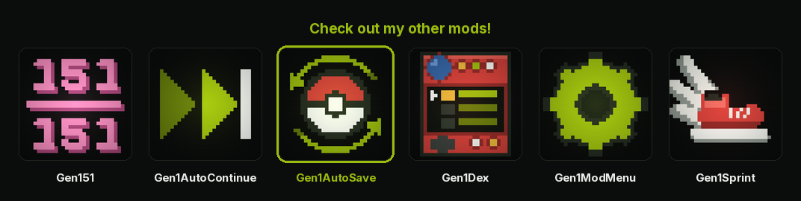

<p align="center">
  <a href="https://wild1walker.github.io/Gen1Wild/"></a>
</p>

<h1 align="center">Gen1AutoSave</h1>

<p align="center">
  <a href="https://wild1walker.github.io/Gen1Wild/"></a>
</p>

<p align="center">
  <b>Manual saving, made optional</b><br>
  An autosave mod for <a href="https://github.com/bryanthaboi/gen1recomp">gen1recomp</a>
  that is deliberately careful around the built-in save sync.
</p>

<p align="center">
  <br>
  <i>The save indicator, frame by frame, in the screen's top right corner
  instead of a text box across the playfield: a Poke Ball that wobbles when a
  save lands, and a cross that blinks when one is held.<br>
  Drawn from main.lua by <code>tools/logo/frames.py</code>.</i>
</p>

## Installing

**From the launcher, by index.** In **MODS > FIND MODS**, add the index

```
wild1walker/Gen1AutoSave
```

and the mod shows up as a card you can install and update in place. The repo
page URL, the Pages root and the feed URL itself all resolve to the same
source, so any of them works in that box.

**By hand.** **MODS > Import mod .zip**, using the archive from the
[latest release](../../releases/latest).

Adding an index is a deliberate act of trusting whoever publishes it, and this
one publishes exactly one mod: this one. A listing buys nothing extra either
way — installing from a card runs the same import a .zip does, and the
installer still refuses an archive whose manifest id is not `gen1autosave`.

## What it does

- **Saves after things happen** — battles, catches, evolutions, hatches, trades,
  blackouts, entering a new map. Between them they cover ordinary play, which
  is why the clock below ships `OFF`. Each one saves as soon as the overworld
  settles, floored at one write every 20 seconds.
- **QUIT asks, then waits.** Picking `QUIT` puts up `SAVE AND RETURN TO MAIN
  MENU?` in place of the engine's own confirm. `YES` saves behind a
  `Now saving...` box and holds the quit until the write *and* the upload it
  starts are done, so the save reaches the server while there is still a game
  running to send it. `NO` cancels, exactly as before. Nothing is promised
  when nothing would be written — with a clean save, or a sync conflict
  standing, you get the vanilla prompt and the vanilla quit.
- **Answers the conflict that is not one.** A save sync conflict whose two
  sides come from the same play session is this device's own lost upload rather
  than a second player, and the mod answers those itself — keep this device —
  so they never reach you. Real disagreements still do.
- **An optional play-time timer**, off by default. Turned on, a long gym battle
  advances it, so `5 MIN` means five minutes of playing rather than five
  minutes of standing on a route. The write itself still waits for a settled
  overworld.
- **A Poke Ball that wobbles** in the top right corner when a save lands, in
  place of a text box across the screen. One tile in from the corner of the
  game itself, which is the window's corner when the map fills it and the
  picture's corner under FAITHFUL RATIO, where the bars around the picture are
  dead display. On the rare save that gets held, the same slot blinks a red
  cross instead. Switchable to a small `SAVED` panel, the classic text box, or
  off.
- **Optional rollback backups** of recent autosaves, reachable from the START
  menu.

Manual saving is untouched: it writes and syncs exactly as it does without this
mod. The only thing that happens here is the clock resetting, so an autosave
does not land on top of a save you just made yourself.

## Options

| Option | Default | Notes |
| --- | --- | --- |
| `AUTO SAVE` | on | Master switch. |
| `INTERVAL` | OFF | An extra save every so much play time, on top of the events. |
| `AFTER EVENTS` | on | Save after battles, catches, new areas and so on. |
| `ON QUIT` | on | Offer the save in the QUIT confirm, and wait for it. |
| `HEAL CONFLICTS` | on | Answer a "conflict" that is really your own lost upload. |
| `SAVE ON LOADS` | on | Save on the black screen a warp or a battle already puts up. |
| `QUIET SYNC` | on | Keep a sync cycle out of the frames you are mid-step in. |
| `INDICATOR` | POKE BALL | `OFF`, `POKE BALL`, `SAVED TEXT`, or `TEXT BOX`. |
| `SAVE BACKUPS` | off | Keep rollback copies. Adds `BACKUPS` to the START menu. |
| `BACKUPS KEPT` | 5 | Ring size: 3, 5, 10 or 20. |

If autosaving goes quiet, look for the held badge in place of the usual save
indicator — a **flashing red cross** where the Poke Ball would be, or the word
`PAUSED` in the text modes. It means an unresolved save sync conflict **over
the save you are playing** is holding every write. **MODS > SAVE SYNC**, pick a
side, and saving resumes.

Most of the time you will not see it, because most of them are not conflicts.
See [When a conflict is not one](#when-a-conflict-is-not-one) below.

**If that screen looks empty, the conflict has not gone away.** The launcher
draws it from rows the engine holds in memory, and those do not survive a
restart: `SyncEngine` persists `state.pendingConflicts` but builds `conflicts`
empty on load, and empties it again at the start of every sync. So there is a
window after each launch — up to five minutes, until the first sweep runs — and
a shorter one around every sync, where the badge is right and the screen has
nothing on it yet. Give it a moment and look again. The mod's log line names
the conflict it is holding for, with both savedAt stamps, so you can tell which
of the two it means before the screen catches up.

The badge is slow on purpose, and quiet about things that are not yours. It
waits until the conflict has stood for fifteen seconds, and it ignores
conflicts about any *other* playthrough. The engine reports one `phase` for
every save it can see and re-plans from scratch on every sync, so neither
"there is a conflict" nor "there is one this instant" means this file is the
one in dispute.

### When a conflict is not one

**These saves were played at the same time** does not mean two people. It is
`SyncEngine.overlaps`, which asks whether `[sessionStart, savedAt]` on the two
sides overlap — and one `sessionStart` covers a whole play session, because
`Game.sessionStartedAt` is stamped once at load and copied into every save meta
written until you close the game. Two revisions of the same session therefore
overlap by definition, and get described as simultaneous play.

Which is exactly what your own device produces when an upload is committed by
the server but its reply never arrives — a dropped connection, a phone putting
the app to sleep mid-request. `state.revs` stays behind the rev the server now
has, and the next plan sees the save changed on *both* ends: locally because
you kept playing, remotely because that upload did land after all. Nothing on
this side can prevent it; by the time anything could look, the reply is gone.

So the mod recognises it instead. When both sides of a conflict carry the
**same `sessionStart`** and the far side is the **older** of the two, it is one
device's file twice — a second device would have called `os.time()` for its own
session, on its own load — and there is only one honest answer to it. The mod
gives that answer itself, `resolveConflict(key, "local")`, which is precisely
the launcher's `Keep this device` button: point `state.revs` at the rev we
never heard about, force-upload the file you are actually playing, carry on.
Nothing is discarded, because the far copy is the one yours came after.

Anything that fails either half of that test is a real disagreement and is left
alone for you to answer. So is a heal that does not stick: after three goes on
one save the mod stops and puts the badge up. `HEAL CONFLICTS` turns the whole
thing off if you would rather see every one of them.

## Working with save sync

`Game:writeSave()` already notifies the sync engine after every successful
write, with a five second upload debounce, so this mod never calls sync
directly. The work is in *not* writing at the wrong moments.

- **Nothing happened, nothing written.** Playtime always advances, so comparing
  save bytes would call every idle minute a change. Instead the engine's own
  events (`world.stepped`, `flag.changed`, `battle.*`, `pokemon.*`, …) mark the
  save dirty, and a clean save is skipped. Leaving the game sitting on a route
  never bumps the save revision or wakes an upload.
- **Never writes mid-sync.** A transfer in flight, or an unresolved conflict
  waiting on you *about this save*, both hold the file still; the save is
  retried once sync settles. Adding a third revision to a disagreement you have
  not answered yet is how a cross-device conflict gets worse — but the engine's
  `phase` is one word for every save it can see, and a conflict about an old
  playthrough on another device is not this file's business, so the hold is
  matched against `protectedKey` rather than taken at the phase's word.
- **One floor between writes.** 20 seconds between any two, whatever asked
  for them, so a row of door transitions cannot hammer the file. There used to
  be a second and longer floor between two *event* saves, from when the timer
  did the steady work and events only had to catch what it missed. Now that
  the events are the mechanism, that minute meant walking through a row of
  rooms and saving at none of them — which reads exactly like map entry not
  being a save trigger at all.
- **Nothing is written inside the quit itself**, either way out of it. A write
  there can only make a revision nothing survives to finish sending: the
  server applies the PUT, the reply dies with the process, and the device
  keeps the old revision — one half of a conflict, with the write supplying
  the other. So the quit save happens in the `QUIT` confirm instead, while
  there is still a game running to carry the upload through — and that quit
  waits for the upload rather than racing it. The five second upload debounce
  is pulled forward while you wait, since it is there to coalesce a burst of
  writes and no burst is coming; a save that cannot be sent inside fifteen
  seconds stops holding the quit, because `QUIT` goes to the title rather than
  out of the process and an upload still running finishes there. All the quit
  hook does now is disarm an upload that was scheduled but not started, so the
  exit cannot cut one open; the next launch uploads it as an ordinary change.
- **One upload woken per five minutes, not one per save.** Planning a sync runs
  on the main thread, and it reads and *decodes* every save slot of every game
  version before any of it reaches a worker — through the restricted-grammar
  reader, which is a character-at-a-time parser written in Lua on purpose, so a
  tampered save fails to parse instead of executing. A quarter-megabyte slot
  costs tens of milliseconds, per slot on disk, across six versions, and a
  phone is worse. Waking that on every autosave — as often as every 20 seconds,
  with `AFTER EVENTS` on — was the loudest thing this mod did to a linked
  device. So an autosave wakes an upload at most every five minutes. Writes in
  between still land on disk; the engine's own five minute sweep carries them
  up, because planning compares each slot's `savedAt` against the revision it
  last saw and uploads anything that moved. Picking `QUIT` is exempt: there is
  no sweep coming for a game that is about to stop running, so that upload has
  to go now or never.

## The frame after a save

The lag around an autosave is mostly not the write. It is the collection of
what the write threw away, and it lands a beat later — which is why it reads as
the game stuttering rather than as the game saving.

A save copies the progress table, serializes the copy into one large string,
reads the previous file back to make the `.bak`, writes that string twice more
and rewrites `options.lua` beside it — and with backups on, deep-copies the
save twice more and serializes that too. Megabytes of short-lived strings, in
one frame. The engine's collector budget is one small step per rendered frame,
sized (by its own comment) for "ordinary Lua-heap garbage — per-frame tables
and closures". A save is a year of that at once, so the collector falls behind,
and the part of a cycle that cannot be split surfaces a second or two later, in
a frame that is just ordinary walking.

So the mod finishes the cycle itself, in the frame that already stopped to
touch the disk and is showing you a Poke Ball while it does. The work is the
same work; paying for it at the save spends a frame you have been told to
expect instead of a slow patch of route afterwards you have not. It is bounded
— a fixed number of steps, stopping the moment the cycle completes — so a large
heap on a phone cannot turn one hitch into a freeze.

A sync cycle leaves the same debt, more of it: planning decoded every slot into
a full table again, a character at a time. So the same catch-up runs in the
frame a cycle finishes on — every cycle, not only the ones an autosave woke,
since after the pacing above most of them are the engine's own sweep.

### Saving on a screen you cannot see

The write is not what you feel; where its frame lands is. On the route that
frame is a stutter in the middle of walking, which is the one place a dropped
frame shows.

The game already blacks the screen out twice for its own reasons — a warp fades
out, swaps the map and fades back, and a battle ends behind a hold and a fade.
Nobody can see a frame during either. So `SAVE ON LOADS` holds a due save until
one of those comes round and writes it there: the loading screen is a few frames
longer, and nothing else changes.

It writes on **`map.entered`**, not `map.exited`. Exited fires at the top of
`setMap`, before the new map is loaded, so a save written there records the map
you just left and the spot you left it from. Entered fires once the new map, your
cell and your facing are all in place, with the transition still up — coherent
state, screen still covered.

Waiting is not on a clock. There used to be a 45-second cap here, on the
reasoning that a player who had not warped or fought in that long was standing
somewhere quiet and a save on the route beat no save. It did not check that they
had *stopped*, so what it actually did was give up and write into a stride —
the one frame this whole path exists to avoid, arriving reliably rather than by
accident.

A due save now waits for as long as the walking lasts, and leaves by one of
three doors: a warp, the end of a battle, or **you standing still**. There is no
fourth.

That third door is why the wait is safe to leave open. "Standing still" is not
`moving == false`: that flag drops for the single frame between two strides, so
somebody walking a long route without stopping satisfies it several times a
second, and that gap is precisely where a dropped frame is seen — the screen is
scrolling on both sides of it. A held direction says the next stride begins on
the next frame, so it is not idle and nothing is written into it. Let go of the
pad and the save lands on the next frame.

Every other rule still applies on a loading screen: the floor between writes, a
live sync transfer, an unresolved conflict and a player still mid-step all
refuse it exactly as they would anywhere else.

### And where the last of it lands

Pacing chose how *often* a cycle runs. It could not choose *when* the expensive
part of one happens, and that is the half you actually feel. The plan is built
against the server's **reply**, not against the request: the engine polls the
handle each frame, and the frame the answer arrives on is the frame that
decodes every slot. So the stall lands on network time — a moment set by
latency and the server, with no relation to anything you did. That is exactly
why it reads as the game hiccupping rather than as the game syncing: nothing on
screen caused it, and nothing on screen explains it. The engine's own five
minute sweep lands the same way, and the pacing above never touched that one.

That work cannot be made cheap from here. It can be made to land where it does
not show. A frame dropped while you are standing still, in a menu, reading a
box or in a battle is a frame nobody sees; the same frame dropped mid-step is a
visible stutter, because the walk cycle and the camera are both part-way
between tiles and both jump when one frame is worth two.

So `QUIET SYNC` holds a cycle that has a reply in hand out of the frames you
are mid-step in, and runs it on the first frame you are not — a fraction of a
second later, because a step is a fraction of a second. Any menu, text box,
battle, doorway or pause releases it immediately. Only when a reply is actually
in flight: the cheap tick that *starts* a cycle is never held, since holding it
would stop the engine's clock for no reason. And the hold is capped at three
seconds, so holding a direction across Route 21 cannot starve sync — after that
the cycle runs wherever it lands, the way it always did.

## Backups

A backup is an engine checkpoint — the data-only progress snapshot plus your
map, tile, facing and the RNG state — stored in `mod.storage`, which is scoped
per game version *and* per playthrough and written atomically. It never touches
`save.lua`, so keeping history beside the save costs no revisions and no
uploads. Old snapshots are deleted as the ring fills.

To roll back: **START > BACKUPS**, pick a time, confirm. The menus unwind before
the rollback applies, because checkpoints need a settled overworld. Once it
lands the mod writes the save immediately, so the file — and the next sync
upload — carries the rolled-back state rather than the newer one it replaced.

Only autosaves become backups. `Checkpoint.inspect` refuses to capture while a
screen is on top, and manual saving happens from inside the START menu.

## Development

Requires `lua5.4`.

```sh
lua5.4 -e "assert(loadfile('main.lua'))"   # syntax
cd tests && lua5.4 test_autosave.lua       # timing, sync gating, quit save
cd tests && lua5.4 test_backups.lua        # ring rotation, menu, rollback
cd tests && lua5.4 test_indicator.lua      # HUD geometry across DPI scales
```

The harnesses stand in fake `game`, `mod.storage`, `mod.checkpoints` and screen
stack objects, so they run without the engine. CI runs all three on every push.

### The mod index feed

`site/data/index.json` is the feed **FIND MODS** reads, generated from
`manifest.json`:

```sh
python3 tools/build_index.py           # rewrite it after a version bump
python3 tools/build_index.py --check   # what CI runs
```

The launcher resolves `owner/repo` to
`https://wild1walker.github.io/Gen1AutoSave/data/index.json` and falls back to
the raw file on `main` when that fails, so the feed works with GitHub Pages
switched off. Turning Pages on for `/site` on `main` just makes the first URL
the one that answers.

Every release publishes the archive twice, versioned and under the fixed name
`gen1autosave.zip`, because the feed's `downloadURL` points at
`/releases/latest/download/gen1autosave.zip`. That is what keeps a static feed
pointing at the newest release; `--check` fails if the workflow stops
publishing it.

To list the mod in the community index at
[bryanthaboi/gen1recomp-mod-index](https://github.com/bryanthaboi/gen1recomp-mod-index)
instead — the one most players already have — use its
[submission helper](https://bryanthaboi.github.io/gen1recomp-mod-index/). The
fields it asks for are the ones already in `manifest.json` and in the feed
entry here.

### Releasing

Push to `main` with the `version` in `manifest.json` bumped ahead of every
existing tag. The release workflow packs the mod, stamps that version into the
archived `manifest.json`, and publishes `gen1autosave-X.Y.Z.zip` as a GitHub
Release. `[release X.Y.Z]` in a commit message, or a manual run with an explicit
version, both override it.

`github` in `manifest.json` points at `wild1walker/Gen1AutoSave`, which is how
the launcher offers updates and other versions.

## Credits

By **Wild**. Written for this mod rather than derived from anyone else's — it
is built on the save, battle and map-transition hooks of
[Pokemon Gen1Recomp](https://github.com/bryanthaboi/gen1recomp), which is what
it listens to and all it takes from anywhere.

**Pokemon** Red, Blue and Yellow are Nintendo / Creatures / GAME FREAK. This is
an unofficial fan mod, distributed free, with no affiliation with or
endorsement by any of them.

## Licence

MIT — see [LICENSE](LICENSE).
